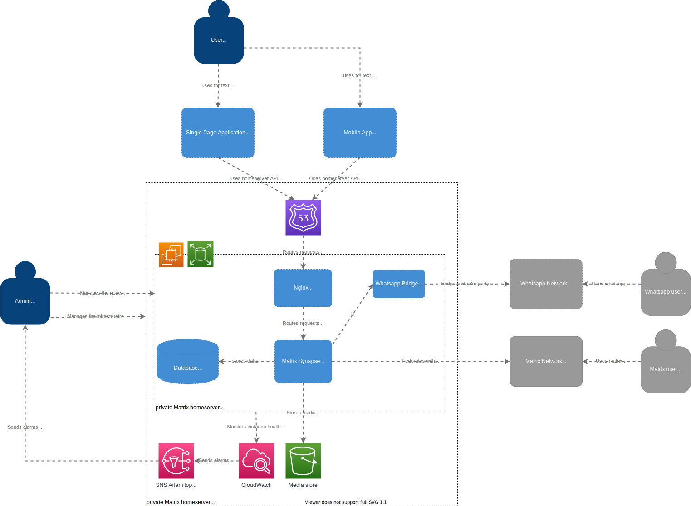

Private [matrix](https://matrix.org/) homeserver for secure, decentralised, real-time communication with friends and family in an attempt to progressively reduce the reliance on WhatsApp and Facebook Messenger. The homeserver is based on [Synapse](https://matrix.org/docs/projects/server/synapse) with Element [web](https://matrix.org/docs/projects/client/element) and [mobile app](https://matrix.org/docs/projects/client/element-android) as client applications.

The whole infrastructure has been set up with the excellent [ansible playbook](https://github.com/spantaleev/matrix-docker-ansible-deploy/tree/master/docs).

# Infrastructure
The server is set up on AWS Cloud, with Route53 for DNS and all homeserver components running on a single t3a.small (2 CPU, 2GB RAM) EC2 EBS-backed instance - this seems good enough performance- and cost-wise for couple of users. Monitoring of the server is based on CloudWatch with automatic alarm notifications via SNS.

Future work:
* Add further bridges (Facebook Messanger, Slack, Discord)
* Automate Disaster Recovery
* Move media store from EBS to S3
* Automate server maintenance

